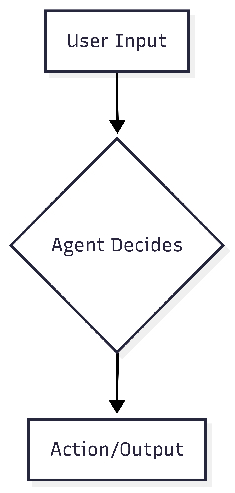
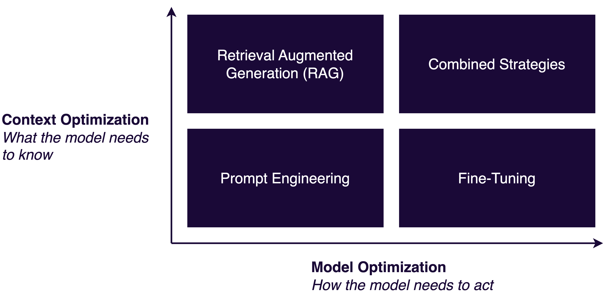
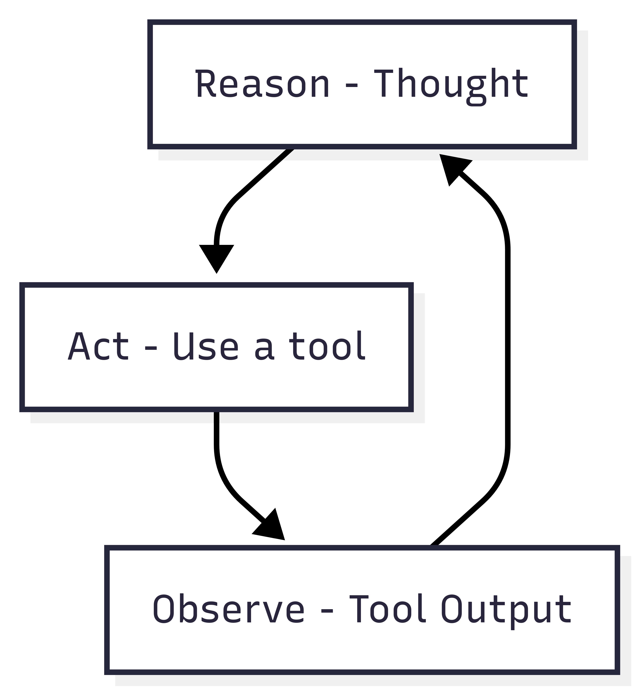

<!-- _class: lead -->

# Atelier Osedea sur LangGraph et Langfuse

La programmation orientée événement ou les microservices sont trop faciles à déboguer ? Vous voulez du hasard dans vos résultats ?

Vous l'avez avec les agents !

---

## Objectif de cet atelier

Examiner un flux de travail agentique simple construit avec LangGraph et introduire l'observabilité avec Langfuse.

*Attention, ce contenu sera probablement obsolète dans 6 mois...*

---

## Que sont les Agents ?

Les agents sont des systèmes qui utilisent un Grand Modèle de Langage (LLM) pour **raisonner** sur un problème, créer un **plan**, et exécuter une séquence d'**actions** pour atteindre un **objectif de manière autonome**. Ils peuvent utiliser des **outils**, comme des moteurs de recherche ou des interpréteurs de code, pour trouver des informations et effectuer des tâches.

---

## Un flux de travail agentique simple

Un agent de base suit un chemin linéaire de l'entrée à la sortie. Au cœur, un agent prendra une décision en fonction du contexte dont il dispose.

---
## Améliorer le comportement du modèle

---

## Le pattern ReAct

ReAct (Raisonner + Agir) est un pattern agentique courant. Au lieu d'une seule décision, l'agent boucle à travers un processus de raisonnement et d'action jusqu'à ce qu'il atteigne une réponse finale.

---

## Qu'est-ce que LangGraph ?

LangGraph est une bibliothèque de l'équipe LangChain pour construire des applications multi-agents avec état. Elle vous permet de définir des flux de travail d'agent sous forme de graphes, où les nœuds représentent des fonctions (ou des appels LLM) et les arêtes représentent le flux de contrôle entre eux.

Cette approche basée sur les graphes est particulièrement bien adaptée pour créer la logique cyclique et complexe requise par les systèmes agentiques.

---

## LangGraph

Flux de contrôle (arêtes) et mises à jour d'état (nœuds).

---

## Concepts de base de LangGraph

*   **État :** Un objet central et persistant qui est passé entre tous les nœuds du graphe. Chaque nœud peut mettre à jour l'état.
*   **Interruptions :** Le graphe peut être mis en pause à tout moment, par exemple, pour attendre une entrée humaine ou pour gérer une erreur. C'est essentiel pour les flux de travail avec intervention humaine.
*   **Points de contrôle :** LangGraph peut sauvegarder automatiquement l'état du graphe. Cela vous permet de reprendre des tâches de longue durée, de récupérer après des échecs et d'inspecter l'historique complet du travail d'un agent.

---

## LangGraph : Instrumenté pour l'observabilité

Un avantage clé de l'utilisation d'un framework comme LangGraph est son instrumentation intégrée. Le framework est conçu pour émettre des données de télémétrie prêtes à l'emploi.

En ajoutant simplement un gestionnaire de rappel d'un outil comme Langfuse, vous pouvez capturer des traces détaillées de l'exécution de votre agent, ce qui rend les flux de travail complexes faciles à observer, déboguer et optimiser.

---

## Qu'est-ce que Langfuse ?

Langfuse est une plateforme d'observabilité et d'analyse open-source spécialement conçue pour les applications LLM. Elle vous aide à :

- **Tracer** des chaînes complexes et des systèmes agentiques.
- **Déboguer** les erreurs et les sorties inattendues.
- **Évaluer** la qualité et la performance de votre application.
- **Gérer** les prompts et les versions.

---

## Références & lectures complémentaires

- [Documentation LangGraph](https://langchain-ai.github.io/langgraph/)
- [Documentation Langfuse](https://langfuse.com/docs)
- [Cookbook d'intégration Langfuse & LangGraph](https://langfuse.com/docs/integrations/langchain/example-python-langgraph) 